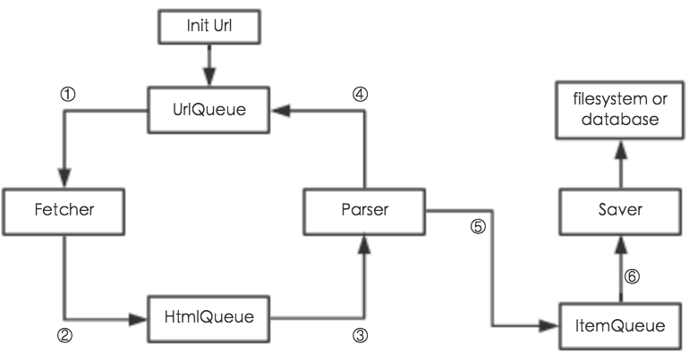

# PSpider

A simple spider frame written by Python, which needs Python3.5+

### Features of PSpider
1. Support two crawlling mode: multi-threading mode and asyncio mode (using aiohttp)
2. ~~Support distributed crawlliing mode (not finished)~~
3. Define some utility functions and classes, for example: UrlFilter, make_random_useragent, etc
4. Fewer lines of code, easyer to read, understand and expand

### Modules of PSpider
1. utilities module: define utilities functions and classes for spider
2. instances module: define classes of fetcher, parser, saver for multi-threading spider
3. concurrent module: define WebSpiderFrame of multi-threading mode and asyncio mode
4. distributed module: define WebSpiderFrame of distributed mode (not finished)

### Procedure of PSpider
1. procedure of multi-threading spider  
  
①: Fetcher gets url from UrlQueue, and makes request based on this url  
②: Put the result of ① to HtmlQueue, and make Parser can get it  
③: Parser gets item from HtmlQueue, and parses it to get new urls and saved items  
④: Put the new urls to UrlQueue, and make Fetcher can get it  
⑤: Put the saved items to ItemQueue, and make Saver can get it  
⑥: Saver gets item from ItemQueue, and saves it to filesystem or database  

2. procedure of asyncio spider  
Similar with multi-threading spider. The only difference is using "coroutine" instead of "multi-threads"  

### Tutorials of PSpider
**Installation: you'd better use the first method**  
（1）Copy the "spider" directory to your project directory, and `import spider`  
（2）Install spider to your python system using `python3 setup.py install`  

**Getting multi-threading spider started: make a demo crawling Douban Movies**  
（1）Import spider `import spider`  
（2）Make a new class of MovieFetcher based on spider.Fetcher, and rewrite functions of url_fetch  
```python
class MovieFetcher(spider.Fetcher):
    def __init__(self, max_repeat=3, sleep_time=0):
        spider.Fetcher.__init__(self, max_repeat=max_repeat, sleep_time=sleep_time)    
        self.session = requests.Session()
        return
    
    def url_fetch(self, url, keys, repeat):
        resp = self.session.get(url, allow_redirects=False, verify=False, timeout=5)
        if resp.status_code == 200:
            return 1, resp.text
        resp.raise_for_status()
```
（3）Make a new class of MovieParser based on spider.Parser, and rewrite functions of htm_parse
```python    
class MovieParser(spider.Parser):
    def htm_parse(self, priority, url, keys, deep, content):
        url_list, save_list = [], []
        soup = BeautifulSoup(content, "html5lib")

        # decide how to parse the content of url, based on 'keys'
        if keys[0] == "index":
            # parse the index page and get new urls
        
            # get the new movie urls of detail page
            div_movies = soup.find_all("a", class_="nbg", title=True)
            url_list.extend([(item.get("href"), ("detail", keys[1]), 0) for item in div_movies])

            # get next index page
            next_page = soup.find("span", class_="next")
            if next_page:
                next_page_a = next_page.find("a")
                if next_page_a:
                    url_list.append((next_page_a.get("href"), ("index", keys[1]), 1))
        else:
            # parse the detail page and get saved items
            content = soup.find("div", id="content")
            ......
            save_list.append(movie)
        return 1, url_list, save_list
```
（4）Create the multi-theading spider, set the start url and start this spider using 20 threads
```python
# initial the WebSpider
dou_spider = spider.WebSpider(MovieFetcher(), MovieParser(max_deep=-1), spider.Saver(), spider.UrlFilter())

# set the start url
dou_spider.set_start_url("https://movie.douban.com/tag/%E7%88%B1%E6%83%85", ("index",), priority=1)

# start this spider and wait for finishing
dou_spider.start_work_and_wait_done(fetcher_num=20)
```

**Getting asyncio spider started: make a demo crawling zhushou.360**  
```python
# get loop
loop = asyncio.get_event_loop()

# initial fetcher / parser / saver, you also can rewrite this three class
fetcher = spider.FetcherAsync(max_repeat=3, sleep_time=0, loop=loop)
parser = spider.ParserAsync(max_deep=1)
saver = spider.SaverAsync(save_pipe=open("out_spider_thread.txt", "w"))

# initial the WebSpiderAsync
web_spider_async = spider.WebSpiderAsync(fetcher, parser, saver, url_filter=spider.UrlFilter(), loop=loop)

# set the start url
web_spider_async.set_start_url("http://zhushou.360.cn/")

# start this spider and wait for finishing
web_spider_async.start_work_and_wait_done(fetcher_num=20)
```

### Demo (Not all demos can be used directly because of the changing of PSpider)
1. demos_yundama
2. demos_nbastats
3. demos_doubanmovies
4. demos_dangdang
5. demos_weibo
6. demos_weixin
7. demos_zhihu

### If you have any questions or advices, you can commit "Issues" or "Pull requests"
